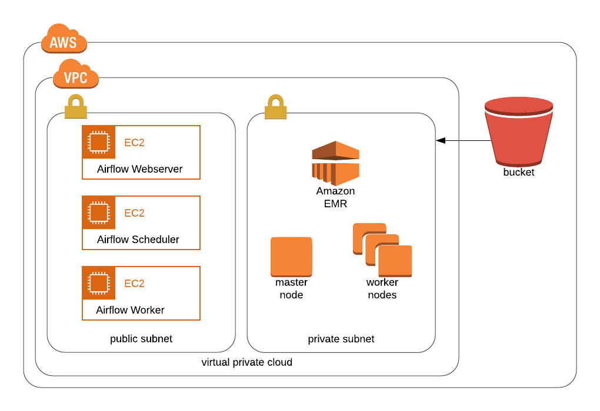

# Reference Architecture for Recommendation Engine

Terraform code to deploy a recommendation engine with Apache Airflow cluster to schedule Spark jobs.



## Reference Module

1. [terraform-aws-airflow](https://github.com/PowerDataHub/terraform-aws-airflow)

2. [terraform-aws-emr-cluster](https://github.com/cloudposse/terraform-aws-emr-cluster)

## Usage
```
terraform init

terraform apply -var-file="example.tfvars"

```
<!-- BEGINNING OF PRE-COMMIT-TERRAFORM DOCS HOOK -->


<!-- END OF PRE-COMMIT-TERRAFORM DOCS HOOK -->


## Inputs

## Outputs
